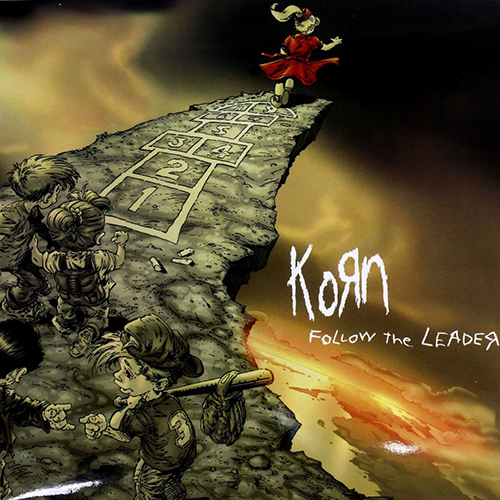
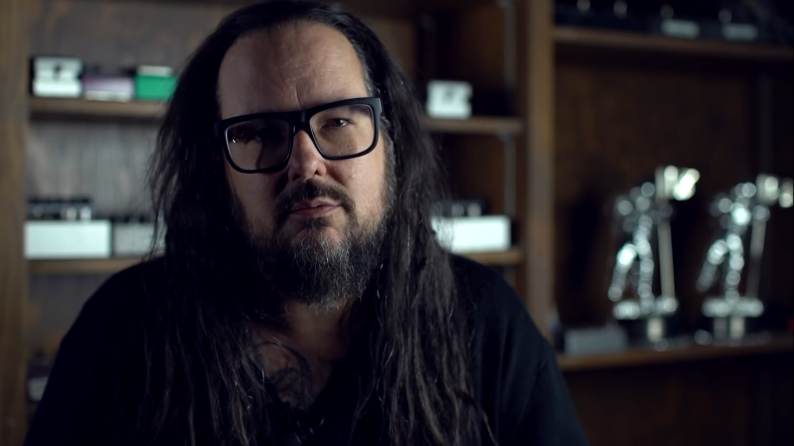

<p align="center">
  
</p>

<br>


# **1. Wprowadzenie**

### Projekt przedstawia stronę zespołu nu-metalowego **KoRn**. Witryna została przygotowana w oparciu o podstawowe technologie, powszechnie znane frameworki, a także dodatkowe biblioteki:

* HTML5
* CSS3
* jQuery
* [AOS](https://michalsnik.github.io/aos/ "Animate On Scroll Library")
* [parallax.js](https://github.com/pixelcog/parallax.js/ "parralax.js")


# **2. Budowa strony**

### Strona została wykonana w stylu *one-page*, nie posiada ona więc dodatkowych podstron, a odnośniki z menu powodują płynne przejście do poszczególnych sekcji.

## **2.1 Nawigacja**

### Pasek menu przygotowany został w podobny sposób jak standardowa nawigacja znana z Bootstrapa. Linki wyświetlane są horyzontalnie dopóki rozdzielczość ekranu jest większa, niż ustalona w media queries dla urządzeń mobilnych. Poniżej tej rozdzielczości pojawia się tzw. *"hamburger"*, który powiązany jest ze zdarzeniem ```slideToggle()```. Dla uzyskania efektu animacji przycisku, skorzystano z gotowych efektów udostępnionych przez Jonathana Suh'a na [jego stronie](https://jonsuh.com/hamburgers/ "Hamburgers").

<p align="center">
  
</p>

```JavaScript

  var $hamburger = $(".hamburger");
  $hamburger.on("click", function() {
      $hamburger.toggleClass("is-active"); 
      $("#menu").slideToggle();
  });
```

### By zapewnić lepszą przejrzystośc nawigacji, rozbudowano ją o sposób wyświetlania podczas zmiany orientacji na urządzeniach mobilnych na tzw. *landscape view*, tak by odnośniki rozmieszczone były w jednej linii:

<br>

<p align="center">
  
</p>

<br>

```css
.menuItem {
  display: inline-block;
  margin: 0 0.8em;
}

@media screen and (max-width: 767.98px) {
  @media (orientation: portrait){
    .menuItem{
      display: block;
      text-align: center;
      margin: 1.8em 0;
    }
  }
  @media (orientation: landscape){
    .menuItem{
      margin: 1.8em 0;
    }
  }
}

```

### Oprócz tego dodatkowy efekt stanowi zmiana przezroczystości tła oraz rozmiaru tekstu i loga podczas scrollowania. Efekt ten uzyskano stosując własność ```scrollTop()``` obiektu documentElement. Pozwala ona na określić liczbę pikseli, o które element został przewinięty w górę. W tym przypadku wystarczyło wykrycie, czy liczba pikseli jest większa od 0:

<br>

<p align="center">
  
</p>

<br>

```JavaScript
$(window).scroll(function(){
    if($(document.documentElement).scrollTop() > 0) {
        $("header").css({
            "position" : "fixed",
            "z-index" : "2",
            "background-color" : "rgba(0,0,0,0.98)",
            "transition" : "all .4s ease-in-out",
            "border-bottom" : "1px solid rgba(255,255,255,0.2)"
        });
        $("#brandImage img").css({
            "height" : "70px",
            "transition" : "all .4s ease-in-out"
        });
        $(".menuLink").css({
            "font-size" : "1.1em",
            "transition" : "all .4s ease-in-out"
        });
    } 
    else{
        $("header").css({
            "position" : "",
            "z-index" : "0",
            "background-color" : "none",
            "border-bottom" : "none",
            "transition" : "all .4s ease-in-out"
        });
        $("#brandImage img").css({
            "height" : "100px",
            "transition" : "all .4s ease-in-out"
        });
        $(".menuLink").css({
            "font-size" : "1.3em",
            "transition" : "all .4s ease-in-out"
        });
    } 
});
```

### Do wpomnianego wcześniej płynnego przejścia do wybranej z menu sekcji rownież użyto właściwości ```scrollTop()```, tym razem jednak ustawiając jej wartość, a nie odczytując jak poprzednio. Do określenia tej wartości skorzystano z metody ```offset().top``` i atrybutu ```href``` który jest stanowi odpowiednikiem identyfikatorów poszczególnych sekcji strony.

```JavaScript
$("a[href^='#']").click(function(e) {
    e.preventDefault(); 
    if($(this).attr("href") == "#top"){
        $("body, html").animate({scrollTop: 0}, 1000, 'swing');
    } 
    else{
        var position = $($(this).attr("href")).offset().top; 
        $("body, html").animate({scrollTop: position-45}, 1000, 'swing');
    }   
});
```

<br>

<p align="center">
  
</p>

<br>

## **2.2 Sekcja "Band"**

### Kontenery z sylwetkami członków zespołu wykorzystują efekty z bilioteki *AOS*, takie jak *fade-up*, czy *fade-down*. Efekty te przypisywane są poprzez atrybut ```data-aos```. Dodatkowo za pomocą ```data-aos-delay``` określone mogą zostać opóźnienia wykonania poszczególnych animacji. Pełną listę efektów biblioteki *AOS* oraz jej parametrów do edycji można znaleźć [pod tym adresem](https://michalsnik.github.io/aos/ "Animate On Scroll Library").

```html
<div class="strip" data-aos="fade-up">
  
  <div class="stripFooter">
      <h3>Reginald Arvizu</h3>
      <h1>"Fieldy"</h1>
      <h3>(bass)</h3>
  </div>
</div>
```

### W celu zainicjalizowania biblioteki *AOS* należy do pliku HTML załączyć poniższy skrypt:

```JavaScript
AOS.init({
    once: true,
    duration: 500
}); 
```

<br>

<p align="center">
  
</p>


<br>

### Sekcja *"Band"* zmienia się w sposób responsywny. Poniżej 768px kontener przekształca się w tzw. *"karuzelę"* w której wyświetlanych jest jednocześnie tylko trzech członków zespołu, bądź jeden dla rozdzielczości jeszcze mniejszych. Karuzelą można sterować za pomocą przycisków w lewą oraz prawą stronę. W przypadku braku akcji, karuzela działa automatycznie, przesuwając się w lewo zgodnie z ustalonym interwałem.

```JavaScript
var interval = window.setInterval(rotateStrips, 5000);
$('#nextStrip').on('click', leftStrip);
$('#previousStrip').on('click', rightStrip);

function rotateStrips(){
    $('#nextStrip').off('click');
    $('#previousStrip').off('click');

    var firstStrip = $('.carousel').find('.strip:first');
    var width = firstStrip.outerWidth();
    
    firstStrip.animate({marginLeft: -width}, 1000, function(){
        var lastStrip = $('.carousel').find('.strip:last');
        lastStrip.after(firstStrip);
        firstStrip.css({marginLeft: 4});
        $('#nextStrip').on('click', leftStrip);
        $('#previousStrip').on('click', rightStrip);
    });
}
```

### Podczas automatycznego wykonywania przesunięcia karuzeli, zdarzenia ```click``` przycisków są wyłączane i ponownie uruchamiane po jego jego zakończeniu. Karuzela działa w ten sposób, że co 5s powtarzana jest funkcja ```rotateStrips()```. W funkcji tej wykryte zostaje pierwsze dziecko klasy ```strip```, a nastepnie przesunięte jest ono w lewo o odległość odpowiadającą jego szerokości. Kolejnym krokiem jest ustawienie dziecka zaraz za ostatnim elementem o klasie ```strip```.

<br>

<p align="center">
  
</p>

<br>

### W podobny sposób wykonywane jest manualne przesunięcie. Poniżej przedstawiono przykładowy kod dla przesunięcia w lewo:

```JavaScript
function leftStrip(){
    window.clearInterval(interval);
    $('#nextStrip').off('click');
    $('#previousStrip').off('click');

    var currentStrip = $('.carousel').find('.strip:first');
    var width = currentStrip.outerWidth();

    currentStrip.animate({marginLeft: -width}, 1000, function(){
        var lastStrip = $('.carousel').find('.strip:last')
        lastStrip.after(currentStrip);
        currentStrip.css({marginLeft: 4});
        $('#nextStrip').on('click', leftStrip);
        $('#previousStrip').on('click', rightStrip);
        interval = window.setInterval(rotateStrips, 5000);
    });
  }
```

## **2.3 Sekcja "Music"**

### W sekcji *"Music"* zaprezentowane zostały okładki albumów. Po najechaniu na nie, wysokośc div'a o klasie ```albumFooter``` zostaje rozciągnięta na 100% kafelki, odsłaniając tym samym szczegóły dotyczące tytułu albumu, roku jego wydania oraz odnośnikiem do Spotify. Dodatkowy efekt stanowi tutaj zmiana przezroczystości footer'a oraz skali szarości obrazu w tle.

<br>

<p align="center">
  
</p>

<br>

```HTML
<div class="albumBox" data-aos="zoom-in">
    
    <div class="albumFooter">
        <h2>Follow the Leader</h2>
        <h3>1998</h3>
        <a href="https://open.spotify.com/album/0gsiszk6JWYwAyGvaTTud4" target="_blank"></a>
    </div>
</div>
```

```css
.albumBox:hover .albumImage{
  filter: grayscale(0);
  transform: scale(1.05);
  transition: all 500ms ease-in-out;
}
.albumBox:hover .albumFooter{
  bottom: 0;
  height: 100%;
  transition: height .3s ease-in-out, background-color .3s ease-in-out;
  background-color: rgba(0, 0, 0, 0.8);
}
```

## **2.4 Sekcja "Video"**

### Część strony zatytułowana *"Video"* składa się z *"thumbnail'ów"* odłowujących się do koncertów, teledysków i wywiadów przeprowadzanych z zespołem. Kontener o klasie ```videoContainer``` zbudowany jest z przycisku Play, znacznika ```video``` wskazującego na poszczególne klipy oraz ```videoPoster'a``` stanowiącego tło thumbnail'a. 

```HTML
<div class="videoContainer" data-aos="fade-zoom-in">
    
    <video class="video" preload="none">
      <source src="video/korn_2019_docuseries_episode_06.mp4" type="video/mp4">
    </video>
    
</div>
```

### Zastosowanie atrybutu ```controlList``` umożliwia odwołanie się do właściwości odtwarzacza, a w tym między innymi do parametru odpowiedzialnego za zablokowanie możliwości pobrania pliku. Ustawienie ```disablePictureInPicture``` blokuje zaś wyświetlanie video w tzw. "pływającym oknie" będącym zawsze na wierzchu w stosunku do przeglądarki oraz innych aplikacji. Właściwość ```preload="none"``` zapobiega ładowaniu plików podczas wgrywania się strony.

```JavaScript
$("video").each(function(){
    $(this).attr('controlsList','nodownload');
    $(this).attr('disablePictureInPicture','true');
    $(this).load();
});
```

<br>

<p align="center">
  
</p>

<br>

### Przyciśnięcie przycisku Play powoduje rozpoczęcie odtwarzania video w trybie pełnoekranowym. Zamknięcie trybu pełnoekranowego jest równoznaczne z zatrzymaniem video. Działanie to umożliwia poniższy kod:

```JavaScript
$('.videoButton').click(function(){
    $(this).next('.video').get(0).play();
    $(this).next('.video').get(0).webkitRequestFullScreen();
});
$('.video').bind('webkitfullscreenchange mozfullscreenchange fullscreenchange', function(e) {
    var state = document.fullScreen || document.mozFullScreen || document.webkitIsFullScreen;
    if(!state){
        $(this).get(0).pause();
    } 
});
```

## **2.5 Sekcja "Tour"**

### Ostatnią część strony stanowi tabela z rozpisaną trasą koncertową zespołu. W celu zachowania jej poprawnego i sensownego wyświetlania na urządzeniach mobilnych, najmniej istotna kolumna jest ukrywana:

```css
@media screen and (max-width: 575.98px) {
  #tourTable td:nth-child(2){
    display:none;
    width:0;
    height:0;
    opacity:0;
    visibility: collapse;
  }
}
```

<br>

<p align="center">
  
</p>

<br>